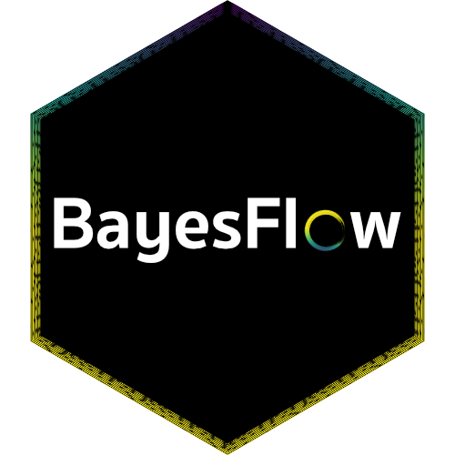
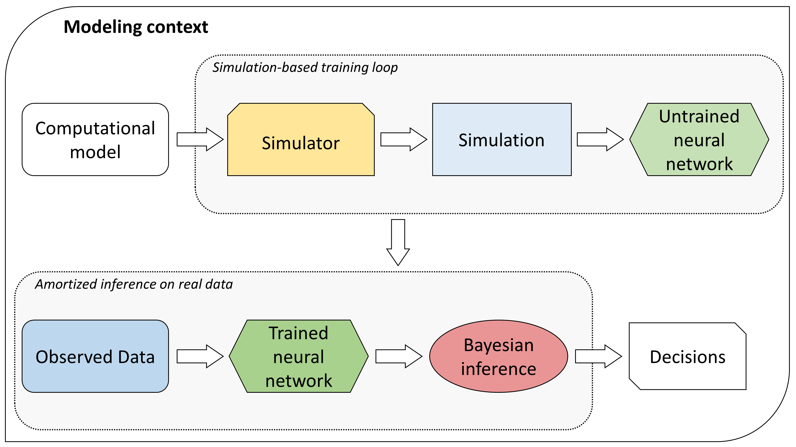
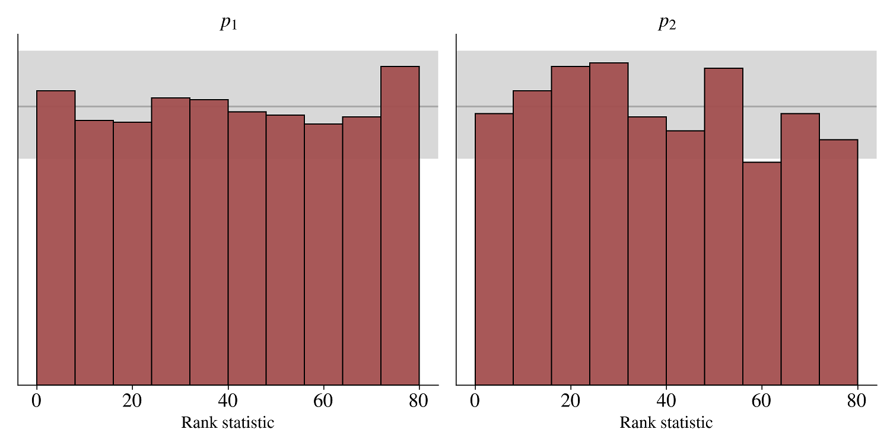
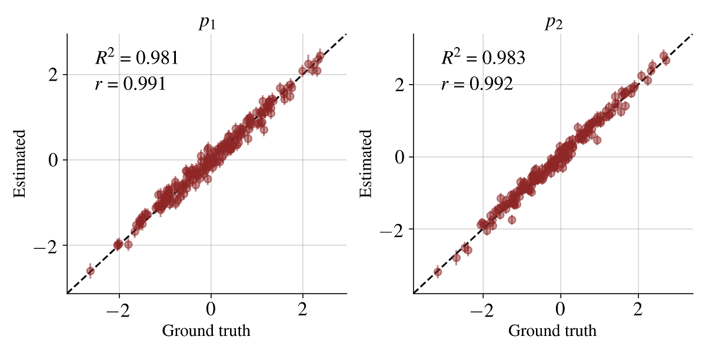
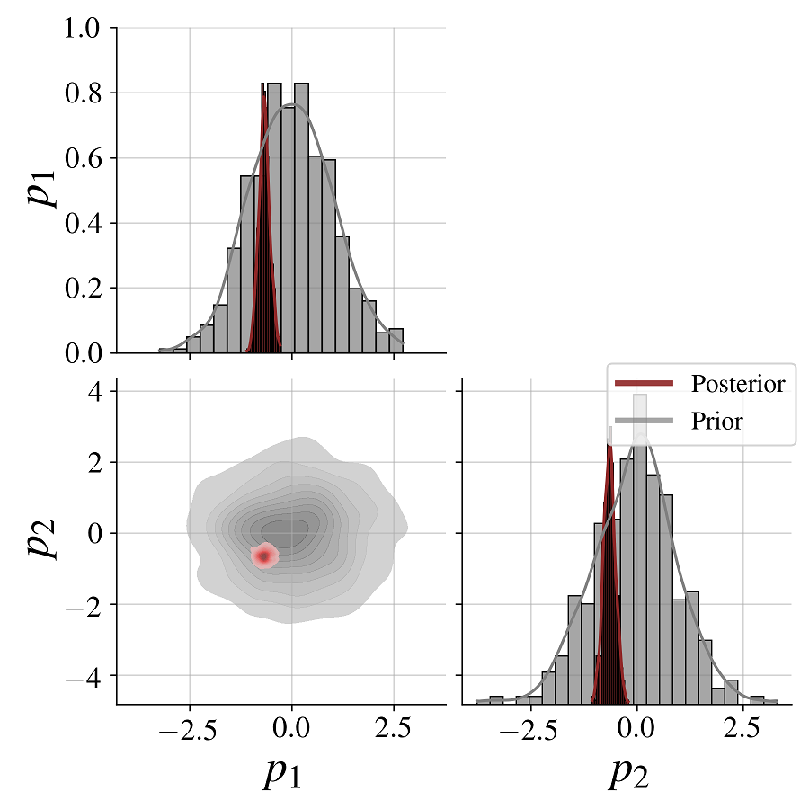
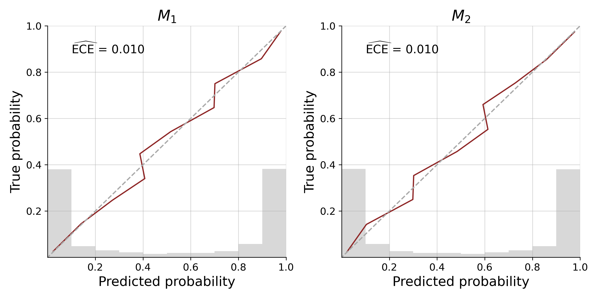
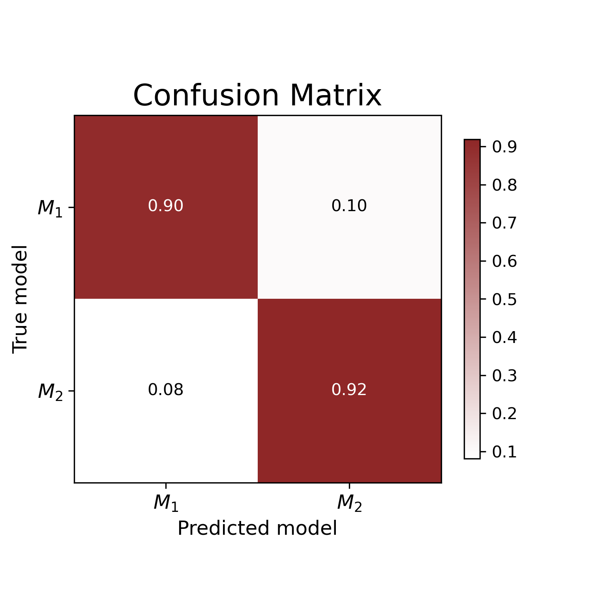

# BayesFlow 

[](https://github.com/stefanradev93/bayesflow/actions)
[](https://img.shields.io/github/license/stefanradev93/BayesFlow)

Welcome to our BayesFlow library for efficient simulation-based Bayesian workflows! Our library enables users to create specialized neural networks for *amortized Bayesian inference*, which repay users with rapid statistical inference after a potentially longer simulation-based training phase.

For starters, check out some of our walk-through notebooks:

1. [Quickstart amortized posterior estimation](docs/source/tutorial_notebooks/Intro_Amortized_Posterior_Estimation.ipynb)
2. [Detecting model misspecification in posterior inference](docs/source/tutorial_notebooks/Model_Misspecification.ipynb)
3. [Principled Bayesian workflow for cognitive models](docs/source/tutorial_notebooks/LCA_Model_Posterior_Estimation.ipynb)
4. [Posterior estimation for ODEs](docs/source/tutorial_notebooks/Linear_ODE_system.ipynb)
5. [Posterior estimation for SIR-like models](docs/source/tutorial_notebooks/Covid19_Initial_Posterior_Estimation.ipynb)
6. [Model comparison for cognitive models](docs/source/tutorial_notebooks/Model_Comparison_MPT.ipynb)
7. [Hierarchical model comparison for cognitive models](docs/source/tutorial_notebooks/Hierarchical_Model_Comparison_MPT.ipynb)

## Project Documentation

The project documentation is available at <https://bayesflow.readthedocs.io>

## Installation

See [INSTALL.rst](INSTALL.rst) for installation instructions.

## Conceptual Overview

A cornerstone idea of amortized Bayesian inference is to employ generative
neural networks for parameter estimation, model comparison, and model validation
when working with intractable simulators whose behavior as a whole is too
complex to be described analytically. The figure below presents a higher-level
overview of neurally bootstrapped Bayesian inference.



## Getting Started: Parameter Estimation

The core functionality of BayesFlow is amortized Bayesian posterior estimation, as described in our paper:

Radev, S. T., Mertens, U. K., Voss, A., Ardizzone, L., & Köthe, U. (2020).
BayesFlow: Learning complex stochastic models with invertible neural networks.
<em>IEEE Transactions on Neural Networks and Learning Systems</em>, available
for free at: https://arxiv.org/abs/2003.06281.

However, since then, we have substantially extended the BayesFlow library such that
it is now much more general and cleaner than what we describe in the above paper.

### Minimal Example

```python
import numpy as np
import bayesflow as bf
```

To introduce you to the basic workflow of the library, let's consider
a simple 2D Gaussian model, from which we want to obtain
posterior inference.  We assume a Gaussian simulator (likelihood)
and a Gaussian prior for the means of the two components,
which are our only model parameters in this example:

```python
def simulator(theta, n_obs=50, scale=1.0):
    return np.random.default_rng().normal(loc=theta, scale=scale, size=(n_obs, theta.shape[0]))

def prior(D=2, mu=0., sigma=1.0):
    return np.random.default_rng().normal(loc=mu, scale=sigma, size=D)
```

Then, we connect the `prior` with the `simulator` using a `GenerativeModel` wrapper:

```python
generative_model = bf.simulation.GenerativeModel(prior, simulator)
```

Next, we create our BayesFlow setup consisting of a summary and an inference network:

```python
summary_net = bf.networks.DeepSet()
inference_net = bf.networks.InvertibleNetwork(num_params=2)
amortizer = bf.amortizers.AmortizedPosterior(inference_net, summary_net)
```

Finally, we connect the networks with the generative model via a `Trainer` instance:

```python
trainer = bf.trainers.Trainer(amortizer=amortizer, generative_model=generative_model)
```

We are now ready to train an amortized posterior approximator. For instance,
to run online training, we simply call:

```python
losses = trainer.train_online(epochs=10, iterations_per_epoch=500, batch_size=32)
```

Before inference, we can use simulation-based calibration (SBC,
https://arxiv.org/abs/1804.06788) to check the computational faithfulness of
the model-amortizer combination:

```python
fig = trainer.diagnose_sbc_histograms()
```



The histograms are roughly uniform and lie within the expected range for
well-calibrated inference algorithms as indicated by the shaded gray areas.
Accordingly, our amortizer seems to have converged to the intended target.

Amortized inference on new (real or simulated) data is then easy and fast.
For example, we can simulate 200 new data sets and generate 500 posterior draws
per data set:

```python
new_sims = trainer.configurator(generative_model(200))
posterior_draws = amortizer.sample(new_sims, n_samples=500)
```

We can then quickly inspect the how well the model can recover its parameters
across the simulated data sets.

```python
fig = bf.diagnostics.plot_recovery(posterior_draws, new_sims['parameters'])
```



For any individual data set, we can also compare the parameters' posteriors with
their corresponding priors:

```python
fig = bf.diagnostics.plot_posterior_2d(posterior_draws[0], prior=generative_model.prior)
```



We see clearly how the posterior shrinks relative to the prior for both
model parameters as a result of conditioning on the data.

### References and Further Reading

- Radev, S. T., Mertens, U. K., Voss, A., Ardizzone, L., & Köthe, U. (2020).
BayesFlow: Learning complex stochastic models with invertible neural networks.
<em>IEEE Transactions on Neural Networks and Learning Systems</em>, available
for free at: https://arxiv.org/abs/2003.06281.

- Radev, S. T., Graw, F., Chen, S., Mutters, N. T., Eichel, V. M., Bärnighausen, T., & Köthe, U. (2021).
OutbreakFlow: Model-based Bayesian inference of disease outbreak dynamics with invertible neural networks and its application to the COVID-19 pandemics in Germany. <em>PLoS computational biology</em>, 17(10), e1009472.

- Bieringer, S., Butter, A., Heimel, T., Höche, S., Köthe, U., Plehn, T., & Radev, S. T. (2021).
Measuring QCD splittings with invertible networks. <em>SciPost Physics</em>, 10(6), 126.

- von Krause, M., Radev, S. T., & Voss, A. (2022).
Mental speed is high until age 60 as revealed by analysis of over a million participants.
<em>Nature Human Behaviour</em>, 6(5), 700-708.

## Model Misspecification

What if we are dealing with misspecified models? That is, how faithful is our
amortized inference if the generative model is a poor representation of reality?
A modified loss function optimizes the learned summary statistics towards a unit
Gaussian and reliably detects model misspecification during inference time.


In order to use this method, you should only provide the `summary_loss_fun` argument
to the `AmortizedPosterior` instance:

```python
amortizer = bf.amortizers.AmortizedPosterior(inference_net, summary_net, summary_loss_fun='MMD')
```

The amortizer knows how to combine its losses and you can inspect the summary space for outliers during inference.

### References and Further Reading

- Schmitt, M., Bürkner P. C., Köthe U., & Radev S. T. (2021). Detecting Model
Misspecification in Amortized Bayesian Inference with Neural Networks. <em>ArXiv
preprint</em>, available for free at: https://arxiv.org/abs/2112.08866

## Model Comparison

BayesFlow can not only be used for parameter estimation, but also to perform approximate Bayesian model comparison via posterior model probabilities or Bayes factors.
Let's extend the minimal example from before with a second model $M_2$ that we want to compare with our original model $M_1$:

```python
def simulator(theta, n_obs=50, scale=1.0):
    return np.random.default_rng().normal(loc=theta, scale=scale, size=(n_obs, theta.shape[0]))

def prior_m1(D=2, mu=0., sigma=1.0):
    return np.random.default_rng().normal(loc=mu, scale=sigma, size=D)

def prior_m2(D=2, mu=2., sigma=1.0):
    return np.random.default_rng().normal(loc=mu, scale=sigma, size=D)
```

For the purpose of this illustration, the two toy models only differ with respect to their prior specification ($M_1: \mu = 0, M_2: \mu = 2$). We create both models as before and use a `MultiGenerativeModel` wrapper to combine them in a `meta_model`:

```python
model_m1 = bf.simulation.GenerativeModel(prior_m1, simulator, simulator_is_batched=False)
model_m2 = bf.simulation.GenerativeModel(prior_m2, simulator, simulator_is_batched=False)
meta_model = bf.simulation.MultiGenerativeModel([model_m1, model_m2])
```

Next, we construct our neural network with a `PMPNetwork` for approximating posterior model probabilities:

```python
summary_net = bf.networks.DeepSet()
probability_net = bf.networks.PMPNetwork(num_models=2)
amortizer = bf.amortizers.AmortizedModelComparison(probability_net, summary_net)
```

We combine all previous steps with a `Trainer` instance and train the neural approximator:

```python
trainer = bf.trainers.Trainer(amortizer=amortizer, generative_model=meta_model)
losses = trainer.train_online(epochs=3, iterations_per_epoch=100, batch_size=32)
```

Let's simulate data sets from our models to check our networks' performance:

```python
sims = trainer.configurator(meta_model(5000))
```

When feeding the data to our trained network, we almost immediately obtain posterior model probabilities for each of the 5000 data sets:

```python
model_probs = amortizer.posterior_probs(sims)
```

How good are these predicted probabilities in the closed world? We can have a look at the calibration:

```python
cal_curves = bf.diagnostics.plot_calibration_curves(sims["model_indices"], model_probs)
```



Our approximator shows excellent calibration, with the calibration curve being closely aligned to the diagonal, an expected calibration error (ECE) near 0 and most predicted probabilities being certain of the model underlying a data set. We can further assess patterns of misclassification with a confusion matrix:

```python
conf_matrix = bf.diagnostics.plot_confusion_matrix(sims["model_indices"], model_probs)
```



For the vast majority of simulated data sets, the "true" data-generating model is correctly identified. With these diagnostic results backing us up, we can proceed and apply our trained network to empirical data.

BayesFlow is also able to conduct model comparison for hierarchical models. See this [tutorial notebook](docs/source/tutorial_notebooks/Hierarchical_Model_Comparison_MPT.ipynb) for an introduction to the associated workflow.

### References and Further Reading

- Radev S. T., D’Alessandro M., Mertens U. K., Voss A., Köthe U., & Bürkner P.
C. (2021). Amortized Bayesian Model Comparison with Evidental Deep Learning.
<em>IEEE Transactions on Neural Networks and Learning Systems</em>.
doi:10.1109/TNNLS.2021.3124052 available for free at: https://arxiv.org/abs/2004.10629

- Schmitt, M., Radev, S. T., & Bürkner, P. C. (2022). Meta-Uncertainty in
Bayesian Model Comparison. <em>ArXiv preprint</em>, available for free at:
https://arxiv.org/abs/2210.07278

- Elsemüller, L., Schnuerch, M., Bürkner, P. C., & Radev, S. T. (2023). A Deep
Learning Method for Comparing Bayesian Hierarchical Models. <em>ArXiv preprint</em>,
available for free at: https://arxiv.org/abs/2301.11873

## Likelihood emulation

Example coming soon...
