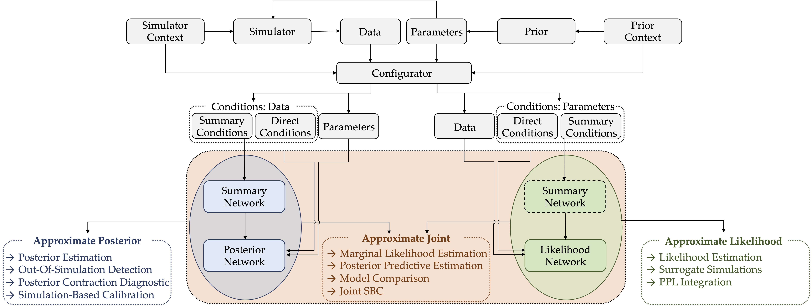

BayesFlow
=========

Welcome to our BayesFlow library for efficient simulation-based Bayesian workflows!
Our library enables users to create specialized neural networks for amortized Bayesian inference,
which repay users with rapid statistical inference after a potentially longer simulation-based training phase.

BayesFlow features four key capabilities to enhance Bayesian workflows:

1. **Amortized posterior estimation:** Train a generative network to efficiently infer full posteriors (i.e., solve the inverse problem) for all existing and future data compatible with a simulation model.
2. **Amortized likelihood estimation:** Train a generative network to efficiently emulate a simulation model (i.e., solve the forward problem) for all possible parameter configurations or interact with external probabilistic programs.
3. **Amortized model comparison:** Train a neural classifier to recognize the "best" model in a set of competing candidates or combine amortized posterior and likelihood estimation to compute Bayesian evidence and out-of-sample predictive performance.
4. **Model misspecification detection:** Ensure that the resulting posteriors are faithful approximations of the otherwise intractable target posterior, even when simulations do not perfectly represent reality.

Installation
------------

.. tab-set::

    .. tab-item:: Users (stable)

       .. code-block:: bash

          pip install bayesflow

    .. tab-item:: Developers (nightly)

       .. code-block:: bash

          pip install git+https://github.com/bayesflow-org/bayesflow@dev

BayesFlow requires Python version 3.9 or later.
The installer should automatically choose the appropriate TensorFlow version depending on your operating system.
However, if the installation fails, Tensorflow and Tensorflow-Probability are likely to be the culprit,
and you might consider starting your bug hunt there.
You can find detailed installation instructions for developers :doc:`here <installation>`.

Citation
--------

You can cite BayesFlow along the lines of:

   - We approximated the posterior with neural posterior estimation and learned summary statistics (NPE; Radev et al., 2020), as implemented in the BayesFlow software for amortized Bayesian workflows (Radev et al., 2023b).
   - We approximated the likelihood with neural likelihood estimation (NLE; Papamakarios et al., 2019) without hand-cafted summary statistics, as implemented in the BayesFlow software for amortized Bayesian workflows (Radev et al., 2023b).
   - We performed simultaneous posterior and likelihood estimation with jointly amortized neural approximation (JANA; Radev et al., 2023a), as implemented in the BayesFlow software for amortized Bayesian workflows (Radev et al., 2023b).

1. Radev, S. T., Schmitt, M., Schumacher, L., Elsemüller, L., Pratz, V., Schälte, Y., Köthe, U., & Bürkner, P.-C. (2023). BayesFlow: Amortized Bayesian workflows with neural networks. *arXiv:2306.16015*. (`arXiv paper <https://arxiv.org/abs/2306.16015>`__)
2. Radev, S. T., Mertens, U. K., Voss, A., Ardizzone, L., Köthe, U. (2020). BayesFlow: Learning complex stochastic models with invertible neural networks. *IEEE Transactions on Neural Networks and Learning Systems, 33(4)*, 1452-1466. (`IEEE TNNLS <https://ieeexplore.ieee.org/document/9298920>`__)
3. Radev, S. T., Schmitt, M., Pratz, V., Picchini, U., Köthe, U., & Bürkner, P.-C. (2023). JANA: Jointly amortized neural approximation of complex Bayesian models. *Proceedings of the Thirty-Ninth Conference on Uncertainty in Artificial Intelligence, 216*, 1695-1706. (`PMLR <https://proceedings.mlr.press/v216/radev23a.html>`__)

::

   @misc{radev2023bayesflow,
     title = {BayesFlow: Amortized Bayesian Workflows With Neural Networks},
     author = {Stefan T Radev and Marvin Schmitt and Lukas Schumacher and Lasse Elsem\"{u}ller and Valentin Pratz and Yannik Sch\"{a}lte and Ullrich K\"{o}the and Paul-Christian B\"{u}rkner},
     year = {2023},
     publisher= {arXiv},
     url={https://arxiv.org/abs/2306.16015}
   }

   @inproceedings{radev2023jana,
     title={{JANA}: Jointly Amortized Neural Approximation of Complex Bayesian Models},
     author={Stefan T. Radev and Marvin Schmitt and Valentin Pratz and Umberto Picchini and Ullrich Koethe and Paul-Christian Buerkner},
     booktitle={The 39th Conference on Uncertainty in Artificial Intelligence},
     year={2023},
     url={https://openreview.net/forum?id=dS3wVICQrU0}
   }

   @article{radev2020bayesflow,
     title={{BayesFlow}: Learning complex stochastic models with invertible neural networks},
     author={Radev, Stefan T. and Mertens, Ulf K. and Voss, Andreas and Ardizzone, Lynton and K{\"o}the, Ullrich},
     journal={IEEE transactions on neural networks and learning systems},
     volume={33},
     number={4},
     pages={1452--1466},
     year={2020},
     publisher={IEEE}
   }

Acknowledgments
---------------

We thank the `PyVBMC <https://acerbilab.github.io/pyvbmc/>`__ team for their great open source documentation which heavily inspired our docs.
The BayesFlow development team acknowledges support from:
Deutsche Forschungsgemeinschaft (DFG, German Research Foundation)
under Germany’s Excellence Strategy -– EXC-2181 - 390900948 (the Heidelberg Cluster of Excellence STRUCTURES),
DFG EXC-2075 - 390740016 (the Stuttgart Cluster of Excellence SimTech),
DFG GRK 2277 via the research training group Statistical Modeling in Psychology (SMiP),
the Cyber Valley Research Fund (grant number: CyVy-RF-2021-16),
the Joachim Herz Foundation,
the EMUNE project ("Invertierbare Neuronale Netze für ein verbessertes Verständnis von Infektionskrankheiten", BMBF, 031L0293A-D),
and the Informatics for Life initiative funded by the Klaus Tschira Foundation.

License and Source Code
-----------------------

BayesFlow is released under :mainbranch:`MIT License <LICENSE>`.
The source code is hosted on the public `GitHub repository <https://github.com/bayesflow-org/bayesflow>`__.

Indices
-------

* :ref:`genindex`
* :ref:`modindex`

.. toctree::
   :maxdepth: 0
   :titlesonly:
   :hidden:

   self
   examples
   api/bayesflow
   installation
   contributing
   about
